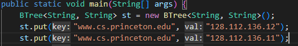
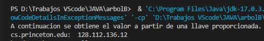

<table>
    <theader>
        <tr>
            <td></td>
            <th>
                UNIVERSIDAD NACIONAL DE SAN AGUSTIN 
                FACULTAD DE INGENIERÍA DE PRODUCCIÓN Y SERVICIOS 
                ESCUELA PROFESIONAL DE INGENIERÍA DE SISTEMAS
            </th>
            <td></td>
        </tr>
    </theader>
    <tbody>
        <tr><td colspan="3">Formato: Guía de Práctica de Laboratorio</td></tr>
        <tr><td>Aprobación:  2022/03/01</td><td>Código: GUIA-PRLD-001</td><td>Página: 1</td></tr>
    </tbody>
</table>

 <h3>INFORME DE LABORATORIO</h3>

<table>
 <theader>
  <tr><th colspan="6" bgcolor="red">INFORMACIÓN BÁSICA</th></tr>
 </theader>
 <tbody>
  <tr><td>ASIGNATUA:</td><td colspan="5">Estructura de Datos y Algoritmos</td></tr>
  <tr><td>TÍTULO DE LA PRACTICA:</td><td colspan="4">Árboles<td></tr>
  <tr><td>NÚMERO DE PRÁCTICA:</td><td>Practica de Laboratorio 06</td><td>AÑO LECTIVO:</td><td>2022 A</td><td>NRO. SEMESTRE:</td><td>III</td></tr>
  <tr><td>FECHA DE PRESENTACIÓN:</td><td>12-Jun-2022</td><td>HORA DE PRESENTACIÓN:</td><td colspan="3">11:30 p.m.</td></tr>
  <tr><td>INTEGRANTES:</td><td colspan="3">-Diego Ivan Pacori Anccasi -Edson Joel López Quispe -Oliver Alessandro Mayta Nolasco -Edwin Francisco Aguilar Tancayo -Jordy Emanuel Ayma Cutipa</td><td>NOTA:</td><td>...</td></tr>
  <tr><td>DOCENTE:</td><td colspan="5">Richart Smith Escobedo Quispe - rescobedoq@unsa.edu.pe</td></tr>
 </tbody>
</table>
<table>
 <theader>
  <tr><th>SOLUCIÓN Y RESULTADOS</th></tr>
 </theader>
 <tbody>
  <tr><td><strong>I. SOLUCIÓN DE EJERCICIOS/PROBLEMAS:</strong> 
  <ul>
    <ol>
        <li>Modificar el método de obtención de valor dado una clave (5 puntos)</li>
        <h3>1.- Funcionamiento del metodo Get</h3>
        
        
El metodo get recibe la clave y verifica si esta es nula para mandar un error, sino retorna el metodo search el cual devuelve un valor

        <h3>2.- Metodo Search (Original)</h3>
        
        
Crea un arreglo de Entry los cuales poseen como atributo clave, valor y un nodo siguiente: a continuacion la clase Entry:

        
        
luego con una condicion la cual exige que la altura sea 0, de lo contrario, verificara el numero de hijos del nodo en un for y dentro de este verificara un if el cual vera si las claves son diferentes, la que le mandamos como parametro y la key del hijo siguiente "children[j+1].key" (si son diferentes = true, si son iguales = false) con el metodo less, a continuacion el metodo less y el eq(este es todo lo contrario al less)

        
        
Al entrar al if, empieza una recursividad la cual implica disminuir la altura, enviarle el nodo del hijo(children[j].next) y la key a buscar

        
        
Cuando la altura llegue a ser 0 va a entrar en el if y va a buscar en los hijos para ver cual de ellos coincide con la clave y al encontrarlo, va a retornar dicho valor, pero solo 1, a pesar de que haya otra key que coincida

        
        
Y nos retornara 1 solo valor de los 2 que ingresamos:

        
        
resultado

        
        <h3>3.- Metodo Search (Modificado)</h3>
        
        
El cambio fue realizado al entrar en el if donde la condicion es el metodo eq, el cual verifica si son iguales, ya no retorna ahi, sino que lo hace fuera del for, para que pueda buscar en todo el nodo de valores, y al momento de realizar la coincidencias lo acumule en un String, y el resultado seria el siguiente:

        
        <h3>4.- Resultados de todas las Pruebas</h3>
        
Codigo Main:

        
        
Resultado:

        
        <li>Mostrar en un diagrama de árbol gráficamente la estructura final para los datos
ingresados. (4 puntos)</li>
        
Estructuta final del arbol B

         
         
Pasos de manera grafica

         
Paso 1 : insetar (www.cs.princeton.edu)

         
        
Paso 2 : insetar (www.cs.princeton.edu)

         
        
Paso 3 : insetar (www.princeton.edu)

         
        
Paso 4 : insetar (www.yale.edu)

         
        
Paso 5 : insetar (www.simpsons.com)

         
        
Paso 6 : insetar (www.apple.com)

         
        
Paso 7 : insetar (www.amazon.com)

         
        
Paso 8 : insetar (www.ebay.com)

         
        
Paso 9 : insetar (www.cnn.com)

         
        
Paso 10 : insetar (www,google.com)

         
        
Paso 11 : insetar (www.nytimes.com)

         
        
Paso 12 : insetar (www.microsoft.com)

         
        
Paso 13 : insetar (www.dell.com)

         
        
Paso 14 : insetar (www.slashdot.org)

         
        
Paso 15 : insetar (www.espn.com)

         
        
Paso 16 : insetar (www.weatcher.com)

         
        
Paso final : insetar (www.yahoo.com)

         
        <li>El método toString() del árbol, retorna lo siguiente. ¿Por qué están entre paréntesis ciertas claves?. <h3><strong>Para esta pregunta se obto por usar números envés de String</strong></h3> 
        Se puede observar que al imprimir el Árbol se logran diferenciar claves entre parérentesis, dichas claves representan los nodos padres, y justamente la indentación simboliza la altura que comparten los nodos
        </li>
        <li>Agregar un nodo adicional (www.youtube.com, 134.24.13.78) y mostrarlo paso a
paso. (3 puntos)</li>
  </ul>

  <tr><td><strong>III. CONCLUSIONES:</strong> - Un AVL es un arbol binario de busqueda que satisface la condicion de estar balanceado 
  - La propiedad del balanceo dice que para cada nodo la diferencia de alturas entre el subarbol izquierdo y derecho es a lo sumo 1 
  - Esta propiedad garantiza que la altura del arbol sea de O(log n) 
  - En cada nodo del arbol se guarda informacion de la altura </td></tr>
 </tbody>
</table>

<table>
 <theader>
  <tr><td><strong>III. RETROALIMENTACIÓN GENERAL</strong> 
  </td><tr>
 </theader>
 <tbody>
  <tr><td>-El Árbol B surgió en 1972, con la idea de mantener índices en almacenamiento externo para acceso a bases de datos, se pretende aprovechar la gran capacidad de almacenamiento, pero organizada de forma que el acceso a una clave sea lo más rápido posible
  </td></tr>
 </tbody>
</table>

<table>
 <theader>
  <tr><td><strong>REFERENCIAS Y BIBLIOGRAFÍA</strong></td><tr>
 </theader>
 <tbody>
  <tr><td>https://programmerclick.com/article/62451418472/</td></tr>
  <tr><td>https://sites.google.com/a/espe.edu.ec/programacion-ii/home/arboles/arbol-b-1</td></tr>
  <tr><td>https://rua.ua.es/dspace/bitstream/10045/16037/8/ped-09_10-tema3_6.pdf</td></tr>
  <tr><td>https://dinahosting.com/ayuda/que-es-un-servidor-dns/</td></tr>
  
 </tbody>
</table>
